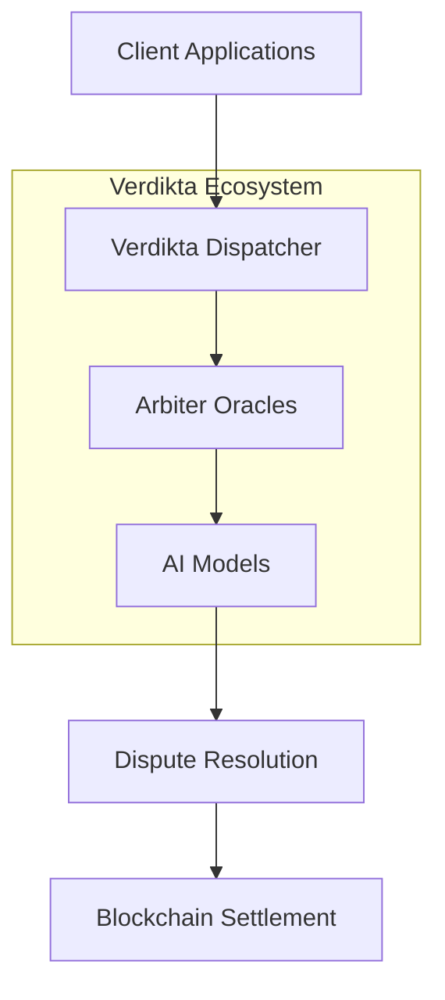

# Verdikta Documentation Site Implementation Guide

This document provides step-by-step instructions for creating `docs.verdikta.org` - a centralized documentation site for the entire Verdikta ecosystem using MkDocs with monorepo support and Vercel hosting.

## 📋 Overview

We are creating a unified documentation site that aggregates content from multiple Verdikta repositories using:
- **MkDocs Material** for the documentation framework
- **mkdocs-monorepo-plugin** to combine docs from multiple repositories
- **Git submodules** to reference source repositories
- **Vercel** for hosting and continuous deployment
- **GitHub Actions** for automated updates

!!! note "Monorepo Plugin Limitations"
    
    If you ever need deep folder nesting, note that some advanced features (like nav auto-discovery) may need extra config. If you add more than one level of subfolders in each component's docs/, check the mkdocs-monorepo-plugin docs for nav options.

## 🎯 Final Architecture

```
verdikta-docs/                 ← NEW GitHub repo (public)
├─ mkdocs.yml                  ← Main configuration
├─ requirements.txt            ← Python dependencies
├─ README.md                   ← Repository documentation
├─ .github/workflows/          ← GitHub Actions
│  └─ update-docs.yml
├─ .vercel/                    ← Vercel configuration
│  └─ project.json
├─ docs/                       ← Root-level docs
│  ├─ index.md                 ← Homepage
│  ├─ overview/                ← High-level documentation
│  └─ changelog/               ← Release notes
├─ assets/                     ← Shared assets
│  ├─ stylesheets/
│  ├─ images/
│  └─ favicon.png
└─ sources/                    ← Submodule mount points
   ├─ arbiter/   (git submodule → verdikta-arbiter)
   ├─ dispatcher/ (git submodule → verdikta-dispatcher)
   ├─ apps/       (git submodule → verdikta-applications)
   └─ common/     (git submodule → verdikta-common)
```

## 🚀 Implementation Steps

### Phase 1: Repository Setup

#### 1.1 Create New Repository

```bash
# Create the repository on GitHub first (public repo: verdikta/verdikta-docs)
# Then clone locally

git clone git@github.com:verdikta/verdikta-docs.git
cd verdikta-docs
```

#### 1.2 Create Directory Structure

```bash
# Create main directories
mkdir -p sources
mkdir -p .github/workflows
mkdir -p .vercel
mkdir -p docs/overview
mkdir -p docs/changelog
mkdir -p assets/stylesheets
mkdir -p assets/images

# Create initial files
touch README.md
touch docs/index.md
touch docs/overview/index.md
touch docs/changelog/index.md
```

#### 1.3 Add Git Submodules

```bash
# Add submodules for each component repository
git submodule add git@github.com:verdikta/verdikta-arbiter.git sources/arbiter
git submodule add git@github.com:verdikta/verdikta-dispatcher.git sources/dispatcher
git submodule add git@github.com:verdikta/verdikta-applications.git sources/apps
git submodule add git@github.com:verdikta/verdikta-common.git sources/common

# Initialize and update submodules
git submodule update --init --recursive
```

!!! warning "Submodule Gotchas"
    
    **Important Reminder**: After cloning the verdikta-docs repo, always run `git submodule update --init --recursive` to pull in all source docs. If you add or update submodules, commit the changes to `.gitmodules` and the updated submodule pointers.

### Phase 2: Configuration Files

#### 2.1 Create `requirements.txt`

```bash
cat > requirements.txt << 'EOF'
mkdocs-material==9.5.9
mkdocs-monorepo-plugin==1.0.4
mike==2.0.0
pymdown-extensions==10.7
mkdocs-mermaid2-plugin==1.1.1
mkdocs-minify-plugin==0.7.1
EOF
```

#### 2.2 Create `mkdocs.yml`

```bash
cat > mkdocs.yml << 'EOF'
site_name: Verdikta Documentation
site_description: Complete documentation for the Verdikta ecosystem
site_author: Verdikta Team
site_url: https://docs.verdikta.org

# Repository
repo_name: verdikta/verdikta-docs
repo_url: https://github.com/verdikta/verdikta-docs
edit_uri: edit/main/

# Configuration
theme:
  name: material
  features:
    - announce.dismiss
    - content.action.edit
    - content.action.view
    - content.code.annotate
    - content.code.copy
    - content.code.select
    - content.tooltips
    - navigation.expand
    - navigation.footer
    - navigation.indexes
    - navigation.sections
    - navigation.tabs
    - navigation.tabs.sticky
    - navigation.top
    - navigation.tracking
    - search.highlight
    - search.share
    - search.suggest
    - toc.follow
    - toc.integrate
  palette:
    - scheme: default
      primary: custom
      accent: custom
      toggle:
        icon: material/brightness-7
        name: Switch to dark mode
    - scheme: slate
      primary: custom
      accent: custom
      toggle:
        icon: material/brightness-4
        name: Switch to light mode
  font:
    text: Inter
    code: JetBrains Mono
  favicon: assets/favicon.png
  logo: assets/logo.png

# Plugins
plugins:
  - monorepo
  - search:
      separator: '[\s\-,:!=\[\]()"`/]+|\.(?!\d)|&[lg]t;|(?!\b)(?=[A-Z][a-z])'
  - minify:
      minify_html: true
  # Optional plugins for future expansion:
  # - mkdocstrings    # For auto-API docs
  # - include-markdown # For including shared content

# Monorepo configuration
monorepo:
  docs_dir: sources/*/docs

# Customization
extra:
  annotate:
    json: [.s2]
  analytics:
    provider: google
    property: !ENV GOOGLE_ANALYTICS_KEY
  social:
    - icon: fontawesome/brands/github
      link: https://github.com/verdikta
    - icon: fontawesome/brands/twitter
      link: https://twitter.com/verdikta

# Custom CSS
extra_css:
  - assets/stylesheets/verdikta.css

# Extensions
markdown_extensions:
  - abbr
  - admonition
  - attr_list
  - def_list
  - footnotes
  - md_in_html
  - toc:
      permalink: true
  - pymdownx.arithmatex:
      generic: true
  - pymdownx.betterem:
      smart_enable: all
  - pymdownx.caret
  - pymdownx.details
  - pymdownx.emoji:
      emoji_generator: !!python/name:material.extensions.emoji.to_svg
      emoji_index: !!python/name:material.extensions.emoji.twemoji
  - pymdownx.highlight:
      anchor_linenums: true
      line_spans: __span
      pygments_lang_class: true
  - pymdownx.inlinehilite
  - pymdownx.keys
  - pymdownx.magiclink:
      normalize_issue_symbols: true
      repo_url_shorthand: true
      user: verdikta
      repo: verdikta-docs
  - pymdownx.mark
  - pymdownx.smartsymbols
  - pymdownx.snippets
  - pymdownx.superfences:
      custom_fences:
        - name: mermaid
          class: mermaid
          format: !!python/name:pymdownx.superfences.fence_code_format
  - pymdownx.tabbed:
      alternate_style: true
      combine_header_slug: true
  - pymdownx.tasklist:
      custom_checkbox: true
  - pymdownx.tilde

# Navigation structure for multi-repo content
nav:
  - Home: index.md
  - Overview:
    - overview/index.md
    - Architecture: overview/architecture.md
    - Whitepaper: overview/whitepaper.md
  - Node Operators:
    - Getting Started: arbiter/installer/index.md
    - Prerequisites: arbiter/installer/prerequisites.md
    - Quick Start: arbiter/installer/quick-start.md
    - Installation:
      - arbiter/installer/installation/index.md
      - Automated Setup: arbiter/installer/installation/automated.md
      - Manual Setup: arbiter/installer/installation/manual.md
      - Components: arbiter/installer/installation/components/index.md
    - Management:
      - arbiter/installer/management/index.md
      - Starting Services: arbiter/installer/management/starting.md
      - Monitoring: arbiter/installer/management/status.md
    - Troubleshooting: arbiter/installer/troubleshooting/index.md
  - Developers:
    - Quick Start: apps/quickstart.md
    - SDK Reference: apps/sdk/index.md
    - REST API: apps/api/index.md
    - GraphQL API: apps/graphql/index.md
    - Examples: apps/examples/index.md
  - Smart Contracts:
    - Overview: dispatcher/contracts/index.md
    - Dispatcher: dispatcher/contracts/dispatcher.md
    - Token & Staking: dispatcher/contracts/token.md
    - Oracle Registry: dispatcher/contracts/oracle.md
    - Deployment: dispatcher/contracts/deployment.md
  - Integrations:
    - Common Utilities: common/integrations/index.md
    - Web3 Providers: common/integrations/providers.md
    - IPFS Integration: common/integrations/ipfs.md
  - Changelog:
    - changelog/index.md
    - Release Notes: changelog/releases.md
EOF
```

!!! tip "Shared Assets"
    
    All shared images and CSS should be referenced from the `/assets/` directory. In your markdown files, link to assets using `/assets/images/...` for consistency across all documentation.

#### 2.3 Create Vercel Configuration

```bash
mkdir -p .vercel
cat > .vercel/project.json << 'EOF'
{
  "name": "verdikta-docs",
  "framework": null,
  "buildCommand": "mkdocs build",
  "outputDirectory": "site",
  "installCommand": "pip install -r requirements.txt",
  "devCommand": "mkdocs serve"
}
EOF
```

#### 2.4 Create GitHub Actions Workflow

```bash
cat > .github/workflows/update-docs.yml << 'EOF'
name: Update Documentation

on:
  push:
    branches: [main]
  schedule:
    # Check for updates every 6 hours
    - cron: '0 */6 * * *'
  workflow_dispatch:

jobs:
  update-submodules:
    runs-on: ubuntu-latest
    steps:
      - name: Checkout repository
        uses: actions/checkout@v4
        with:
          submodules: recursive
          token: ${{ secrets.GITHUB_TOKEN }}

      - name: Update submodules
        run: |
          git pull --rebase
          git submodule update --remote --recursive
          
      - name: Check for changes
        id: changes
        run: |
          if git diff --quiet; then
            echo "changed=false" >> $GITHUB_OUTPUT
          else
            echo "changed=true" >> $GITHUB_OUTPUT
          fi

      - name: Commit and push changes
        if: steps.changes.outputs.changed == 'true'
        run: |
          git config --local user.email "action@github.com"
          git config --local user.name "GitHub Action"
          git add .
          git commit -m "Auto-update submodules"
          git push

      - name: Trigger Vercel deployment
        if: steps.changes.outputs.changed == 'true'
        run: |
          curl -X POST "${{ secrets.VERCEL_DEPLOY_HOOK }}"
EOF
```

### Phase 3: Content Creation

#### 3.1 Create Homepage (`docs/index.md`)

```bash
cat > docs/index.md << 'EOF'
# Verdikta Documentation

Welcome to the comprehensive documentation for the Verdikta ecosystem - a decentralized AI-powered dispute resolution platform built on blockchain technology.

## What is Verdikta?

Verdikta is a decentralized oracle system that provides AI-powered dispute resolution services on blockchain networks. Our ecosystem combines advanced AI models with blockchain infrastructure to deliver fair, transparent, and efficient arbitration services.

## Quick Navigation

<div class="grid cards" markdown>

-   :fontawesome-solid-rocket:{ .lg .middle } **Node Operators**

    ---

    Set up and manage Verdikta Arbiter Nodes for dispute resolution

    [:octicons-arrow-right-24: Node Setup Guide](arbiter/installer/index.md)

-   :fontawesome-solid-code:{ .lg .middle } **Developers**

    ---

    Build applications using Verdikta's APIs and SDKs

    [:octicons-arrow-right-24: Developer Guide](apps/quickstart.md)

-   :fontawesome-solid-file-contract:{ .lg .middle } **Smart Contracts**

    ---

    Integrate with Verdikta's on-chain components

    [:octicons-arrow-right-24: Contract Docs](dispatcher/contracts/index.md)

-   :fontawesome-solid-puzzle-piece:{ .lg .middle } **Integrations**

    ---

    Common utilities and integration patterns

    [:octicons-arrow-right-24: Integration Guide](common/integrations/index.md)

</div>

## Architecture Overview



## Getting Started

Choose your path based on your role:

- **Node Operators**: Start with [Prerequisites](arbiter/installer/prerequisites.md) then follow our [Quick Start Guide](arbiter/installer/quick-start.md)
- **Developers**: Jump into our [Developer Quick Start](apps/quickstart.md)
- **Smart Contract Developers**: Review our [Contract Overview](dispatcher/contracts/index.md)

## Support & Community

- **GitHub**: [Report issues and contribute](https://github.com/verdikta)
- **Documentation**: Browse our comprehensive guides
- **Discord**: [Join our community for support](https://discord.gg/verdikta)
- **Email**: [support@verdikta.org](mailto:support@verdikta.org) for direct assistance
EOF
```

#### 3.2 Create Overview Content

```bash
cat > docs/overview/index.md << 'EOF'
# Verdikta Overview

## System Architecture

Verdikta is built as a modular ecosystem with several key components:

### Core Components

1. **Verdikta Dispatcher** - Smart contract system for managing disputes
2. **Arbiter Oracles** - Chainlink-based nodes that process disputes
3. **AI Processing Engine** - Advanced language models for decision making
4. **Integration Layer** - SDKs and APIs for developers

### Supported Networks

- Base Sepolia (Testnet)
- Ethereum Mainnet (Coming Soon)
- Polygon (Planned)

## How It Works

1. **Dispute Creation**: Users submit disputes through smart contracts
2. **Oracle Assignment**: System assigns qualified arbiters
3. **AI Processing**: Advanced AI models analyze evidence
4. **Decision Making**: Consensus mechanism ensures fair outcomes
5. **Settlement**: Results are recorded on-chain
EOF
```

#### 3.3 Create Changelog

```bash
cat > docs/changelog/index.md << 'EOF'
# Changelog

## Latest Updates

### v1.0.0 - Initial Release
- Complete arbiter node installation system
- Base Sepolia testnet support
- AI-powered dispute resolution
- Chainlink oracle integration

## Coming Soon

- Mainnet deployment
- Additional AI model support
- Enhanced reputation system
- Multi-chain expansion
EOF
```

### Phase 4: Source Repository Preparation

Before the monorepo can work, each source repository needs proper `docs/` structure:

!!! important "Documentation Structure Consistency"
    
    **Critical**: Every source repo must have exactly one `/docs/` folder at its root, and all subfolders must live under that. This simplifies future migration and automation. Store images and diagrams in `/docs/_assets/` within each repository.

#### 4.1 Verdikta Arbiter Repository

```bash
# In verdikta-arbiter repository
mkdir -p docs/installer
# Move existing installer/docs/docs/* content to docs/installer/
# Update any internal links to reflect new paths
```

#### 4.2 Other Repositories

For each of the other repositories, create the following structure:

```bash
# verdikta-dispatcher
mkdir -p docs/contracts
mkdir -p docs/deployment

# verdikta-applications  
mkdir -p docs/api
mkdir -p docs/sdk
mkdir -p docs/examples

# verdikta-common
mkdir -p docs/integrations
mkdir -p docs/utilities
```

!!! tip "Future Enhancement: Documentation CI"
    
    Consider adding a GitHub Action in each component repository to lint and validate markdown in `/docs/`. This prevents broken builds downstream and maintains documentation quality:
    
    ```yaml
    name: Docs Check
    on: [push, pull_request]
    jobs:
      docs-lint:
        runs-on: ubuntu-latest
        steps:
          - uses: actions/checkout@v4
          - name: Lint docs
            run: |
              pip install mkdocs-material
              mkdocs build --strict --config-file docs-only-mkdocs.yml
    ```

### Phase 5: Vercel Setup

#### 5.1 Connect Repository to Vercel

1. Log into [Vercel Dashboard](https://vercel.com/dashboard)
2. Click "Add New..." → "Project"
3. Import `verdikta/verdikta-docs` repository
4. Configure project settings:
   - **Framework Preset**: Other
   - **Build Command**: `mkdocs build`
   - **Output Directory**: `site`
   - **Install Command**: `pip install -r requirements.txt`

#### 5.2 Configure Custom Domain

1. In Vercel project settings, go to "Domains"
2. Add custom domain: `docs.verdikta.org`
3. Configure DNS with your domain provider:
   ```
   CNAME docs.verdikta.org cname.vercel-dns.com
   ```
4. **Security**: Enable "Enforce HTTPS" in Vercel domain settings for security

#### 5.3 Set Up Deploy Hooks

1. In Vercel project settings, go to "Git"
2. Create a "Deploy Hook"
3. Copy the webhook URL
4. Add it as a GitHub secret: `VERCEL_DEPLOY_HOOK`

### Phase 6: Testing and Validation

#### 6.1 Local Testing

```bash
# Install dependencies
pip install -r requirements.txt

# Serve locally
mkdocs serve

# Check that all submodule content is accessible
# Verify navigation works
# Test search functionality
```

#### 6.2 Build Testing

```bash
# Test production build
mkdocs build

# Check for any warnings or errors
# Verify all assets are included
# Test generated site in site/ directory
```

#### 6.3 Content Validation

```bash
# Check all internal links
mkdocs serve --strict

# Validate markdown syntax
# Ensure all images and assets load correctly
# Test responsive design
```

### Phase 7: Deployment and Go-Live

#### 7.1 Initial Deployment

```bash
# Commit all changes
git add .
git commit -m "Initial documentation site setup"
git push origin main

# Verify Vercel deployment succeeds
# Check docs.verdikta.org is accessible
```

#### 7.2 GitHub Actions Setup

1. Go to repository Settings → Secrets and variables → Actions
2. Add secret: `VERCEL_DEPLOY_HOOK` (webhook URL from Vercel)
3. Test the workflow by pushing a change
4. Verify automatic updates work

### Phase 8: Maintenance Procedures

#### 8.1 Adding New Content

```bash
# To add content to a specific repository:
cd sources/arbiter
# Make changes to docs/
git add . && git commit -m "Update docs"
git push

# Update the main docs repo:
cd ../..
git submodule update --remote sources/arbiter
git add . && git commit -m "Update arbiter docs"
git push
```

#### 8.2 Updating Navigation

```bash
# Edit mkdocs.yml nav section
# Test locally
mkdocs serve
# Deploy changes
git add mkdocs.yml && git commit -m "Update navigation"
git push
```

#### 8.3 Regular Maintenance

- Monitor GitHub Actions for failed runs
- Check Vercel deployments for errors
- Review analytics for popular content
- Update dependencies quarterly
- Review and update broken links

#### 8.4 Maintenance Scripts

Create helper scripts for common maintenance tasks:

```bash
# update-all-docs.sh
#!/bin/bash
echo "Updating all documentation submodules..."
git submodule update --remote --merge
git add sources/*
git commit -m "Update all docs submodules"
git push
echo "Done!"
```

#### 8.5 Link Checking

Run regular link validation:

```bash
# Check for broken links before merging
mkdocs build --strict

# Schedule this as a weekly CI job to catch broken links early
```

## 📝 Documentation Conventions

To maintain consistency and quality across all Verdikta documentation:

### Structure Requirements
- Each component repo must maintain a single `/docs/` directory at its root
- Images and diagrams should be stored in `/docs/_assets/` within each repository
- Use relative links for navigation (`../`), not absolute URLs
- All shared assets go in the main docs repo `/assets/` directory

### Content Standards
- Code blocks should specify the language for syntax highlighting
- Frontmatter (title, description) is encouraged at the top of each page
- Use descriptive link text instead of "click here" or raw URLs
- Include alt text for all images for accessibility

### Quality Assurance
- Run `mkdocs build --strict` before submitting PRs to catch broken links
- All new features must include docs updates in the same PR
- Use admonitions (notes, tips, warnings) to highlight important information
- Test documentation locally before pushing changes

### Best Practices
- Write for your audience: operators, developers, or integrators
- Use consistent terminology throughout all documentation
- Include practical examples and code snippets
- Link to related sections for better navigation
- Keep individual pages focused and not overly long

## 🎉 Success Criteria

After implementation, you should have:

- ✅ `docs.verdikta.org` serving comprehensive documentation
- ✅ Content from all Verdikta repositories integrated
- ✅ Automatic updates when source repositories change
- ✅ Professional, searchable interface
- ✅ Fast, reliable hosting on Vercel
- ✅ Easy content management workflow

## 🔧 Troubleshooting

### Common Issues

1. **Submodule not updating**: Run `git submodule update --remote --recursive`
2. **Build fails**: Check `requirements.txt` versions and MkDocs config
3. **Missing content**: Verify source repo has correct `docs/` structure
4. **Links broken**: Update internal links to use new paths
5. **Vercel deploy fails**: Check build logs and configuration
6. **CI pip install fails**: Try running `pip install --upgrade pip setuptools wheel` first to ensure dependencies build cleanly

### Support

- Check GitHub Actions logs for automation issues
- Review Vercel deployment logs for build problems
- Test locally first: `mkdocs serve`
- Validate configuration: `mkdocs config`

This implementation guide provides everything needed to create a professional, maintainable documentation site for the entire Verdikta ecosystem. 