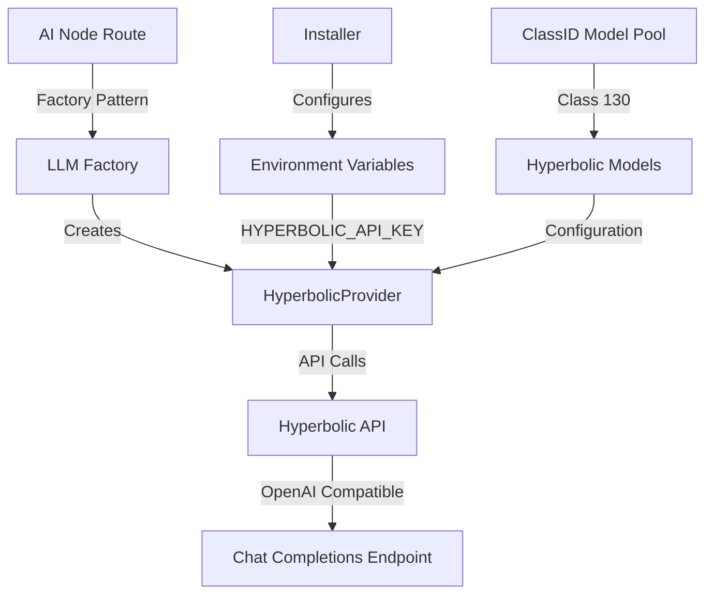

# Hyperbolic Provider Implementation Design Document

## Executive Summary

This document outlines the implementation of Hyperbolic serverless AI inference as a third-party provider for the Verdikta Arbiter Node. Hyperbolic provides OpenAI-compatible APIs for open-source models, offering a cost-effective alternative between local Ollama deployment and proprietary cloud APIs.

**Status:** 🔄 In Progress  
**Last Updated:** October 1, 2025  
**Implementation Branch:** `feature/hyperbolic-provider`

---

## Table of Contents

1. [Overview](#overview)
2. [Architecture](#architecture)
3. [Implementation Plan](#implementation-plan)
4. [API Integration](#api-integration)
5. [Configuration](#configuration)
6. [Testing Strategy](#testing-strategy)
7. [Deployment](#deployment)
8. [Documentation](#documentation)

---

## Overview

### Current State

The Verdikta AI Node currently supports two categories of LLM providers:

| Category | Provider | Deployment | Cost Model | Use Case |
|----------|----------|------------|------------|----------|
| **Proprietary Cloud** | OpenAI, Anthropic | Offsite | Pay-per-token | High-quality, cutting-edge models |
| **Open-Source Local** | Ollama | Onsite | Infrastructure only | Privacy, cost control |

### Proposed Enhancement

Add **Hyperbolic** as a third option providing:

- **Category:** Open-Source Cloud (Serverless)
- **Deployment:** Offsite (Hyperbolic infrastructure)
- **Cost Model:** Pay-per-token (competitive pricing)
- **Use Case:** Scalable open-source models without local infrastructure

### Benefits

✅ **No Infrastructure Required** - Eliminate local GPU/compute costs  
✅ **Cost-Effective** - Competitive pricing for open-source models  
✅ **Scalable** - Auto-scaling serverless infrastructure  
✅ **OpenAI-Compatible** - Minimal integration effort using existing patterns  
✅ **Model Diversity** - Access to Llama, Qwen, DeepSeek, and other OSS models

---

## Architecture

### Provider Hierarchy

```
LLMProvider (Interface)
├── AnthropicProvider
├── OpenAIProvider
├── OllamaProvider
└── HyperbolicProvider (NEW)
    ├── Uses OpenAI-compatible API
    ├── Supports text generation
    ├── Supports image processing (vision models)
    ├── Supports attachment handling
```

### Component Integration



### Data Flow

1. **Request Reception:** AI Node receives arbitration request
2. **Provider Selection:** Factory creates HyperbolicProvider based on model name
3. **API Translation:** Request formatted for OpenAI-compatible endpoint
4. **Hyperbolic Inference:** Model executes on Hyperbolic infrastructure
5. **Response Processing:** Standard LLMProvider response format returned

---

## Implementation Plan

### Phase 1: Core Provider Implementation ✅ (Planned)

#### Task 1.1: Create HyperbolicProvider Class
**File:** `ai-node/src/lib/llm/hyperbolic-provider.ts`

**Status:** 📋 Not Started

**Requirements:**
- [ ] Implement `LLMProvider` interface
- [ ] Constructor with API key from environment
- [ ] Model configuration from `models.ts`
- [ ] Error handling and logging

**Code Structure:**
```typescript
export class HyperbolicProvider implements LLMProvider {
  private apiKey: string;
  private readonly providerName = 'Hyperbolic';
  private readonly baseUrl = 'https://api.hyperbolic.xyz/v1';
  private models: Array<{ name: string; supportsImages: boolean; supportsAttachments: boolean }>;
  
  constructor() {
    // Load API key from environment
    // Load models from modelConfig
    // Initialize provider
  }
  
  async generateResponse(prompt: string, model: string, options?: any): Promise<string>
  async generateResponseWithImage(prompt: string, model: string, base64Image: string, mediaType?: string): Promise<string>
  async generateResponseWithAttachments(prompt: string, model: string, attachments: Array<any>): Promise<string>
  async getModels(): Promise<Array<any>>
  async initialize(): Promise<void>
  supportsImages(model: string): boolean
  supportsAttachments(model: string): boolean
}
```

**Key Considerations:**
- Reuse OpenAI pattern (similar API structure)
- Handle OpenAI SDK compatibility
- Support both text and vision models
- Implement proper timeout handling

#### Task 1.2: Implement API Integration
**Status:** 📋 Not Started

**Requirements:**
- [ ] OpenAI SDK integration with custom base URL
- [ ] Chat completions endpoint support
- [ ] Image/vision model support
- [ ] Attachment handling for multimodal inputs

**API Configuration:**
```typescript
import OpenAI from 'openai';

const client = new OpenAI({
  apiKey: process.env.HYPERBOLIC_API_KEY,
  baseURL: 'https://api.hyperbolic.xyz/v1',
});
```

**Reference:** [Hyperbolic Quickstart Guide](https://docs.hyperbolic.xyz/docs/getting-started)

#### Task 1.3: Error Handling & Validation
**Status:** 📋 Not Started

**Requirements:**
- [ ] API key validation on initialization
- [ ] Model availability checks
- [ ] Rate limiting handling
- [ ] Timeout implementation
- [ ] Graceful degradation

---

### Phase 2: Factory & Configuration Integration ✅ (Planned)

#### Task 2.1: Update LLM Factory
**File:** `ai-node/src/lib/llm/llm-factory.ts`

**Status:** 📋 Not Started

**Changes Required:**
```typescript
// Add to provider selection
case 'hyperbolic':
  return new HyperbolicProvider();

// Update provider type definitions
type ProviderType = 'openai' | 'anthropic' | 'ollama' | 'hyperbolic';
```

#### Task 2.2: Update Model Configuration
**File:** `ai-node/src/config/models.ts`

**Status:** 📋 Not Started

**Initial Model List:**
```typescript
hyperbolic: [
  // High-performance reasoning model (235B parameters)
  { name: 'Qwen/Qwen3-235B-A22B-Instruct-2507', supportsImages: false, supportsAttachments: true },
  // Deep reasoning model with chain-of-thought capabilities
  { name: 'deepseek-ai/DeepSeek-R1', supportsImages: false, supportsAttachments: true },
  // Long-context model (200K+ tokens)
  { name: 'moonshotai/Kimi-K2-Instruct', supportsImages: false, supportsAttachments: true },
]
```

**Note:** ClassID is not required for provider routing. The AI node will route based on provider:model pairs directly.

#### Task 2.3: Environment Configuration
**File:** `ai-node/.env.local`

**Status:** 📋 Not Started

**Required Variables:**
```bash
# Hyperbolic Configuration
HYPERBOLIC_API_KEY=your_api_key_here
HYPERBOLIC_BASE_URL=https://api.hyperbolic.xyz/v1  # Optional override
```

---

### Phase 3: Installer Integration ✅ (Planned)

#### Task 3.1: Update Installation Script
**File:** `installer/bin/setup-environment.sh`

**Status:** 📋 Not Started

**Changes Required:**
- [ ] Add Hyperbolic API key prompt during installation
- [ ] Validate key format (if applicable)
- [ ] Add to `.env` generation
- [ ] Include in configuration summary

**Prompt Flow:**
```bash
echo "Enter your Hyperbolic API key (from https://app.hyperbolic.xyz):"
read -s HYPERBOLIC_API_KEY

if [ -n "$HYPERBOLIC_API_KEY" ]; then
    echo "HYPERBOLIC_API_KEY=$HYPERBOLIC_API_KEY" >> ai-node/.env.local
    echo "✓ Hyperbolic provider configured"
fi
```

#### Task 3.2: Update Installer Documentation
**File:** `installer/docs/quick-start.md`

**Status:** 📋 Not Started

**Sections to Add:**
- [ ] Hyperbolic account creation
- [ ] API key generation instructions
- [ ] Provider selection guidance
- [ ] Cost comparison table

---

### Phase 4: Testing Implementation ✅ (Planned)

#### Task 4.1: Unit Tests
**File:** `ai-node/__tests__/hyperbolic-provider.test.ts`

**Status:** 📋 Not Started

**Test Coverage:**
- [ ] Provider initialization
- [ ] API key validation
- [ ] Model availability checks
- [ ] Text generation
- [ ] Image processing (vision models)
- [ ] Attachment handling
- [ ] Error scenarios
- [ ] Timeout handling

#### Task 4.2: Integration Tests
**Status:** 📋 Not Started

**Test Scenarios:**
- [ ] End-to-end arbitration with Hyperbolic models
- [ ] Mixed provider requests (Hyperbolic + OpenAI)
- [ ] Image input processing
- [ ] ClassID 130 model pool validation
- [ ] API connectivity and error recovery

#### Task 4.3: Performance Testing
**Status:** 📋 Not Started

**Metrics to Measure:**
- [ ] Response latency vs. Ollama/OpenAI
- [ ] Token throughput
- [ ] Cost per arbitration request
- [ ] Concurrent request handling

---

## API Integration

### Endpoint Reference

Based on [Hyperbolic Documentation](https://docs.hyperbolic.xyz/docs/getting-started):

#### Text Generation
```bash
POST https://api.hyperbolic.xyz/v1/chat/completions
Content-Type: application/json
Authorization: Bearer {HYPERBOLIC_API_KEY}

{
  "model": "meta-llama/Meta-Llama-3.1-70B-Instruct",
  "messages": [
    {"role": "system", "content": "You are a helpful assistant."},
    {"role": "user", "content": "Analyze this arbitration case..."}
  ],
  "temperature": 0.7,
  "max_tokens": 1024
}
```

#### Vision Models (Image Processing)
```bash
POST https://api.hyperbolic.xyz/v1/chat/completions

{
  "model": "meta-llama/Llama-3.2-11B-Vision-Instruct",
  "messages": [
    {
      "role": "user",
      "content": [
        {"type": "text", "text": "What is in this image?"},
        {"type": "image_url", "image_url": {"url": "data:image/jpeg;base64,..."}}
      ]
    }
  ]
}
```

### OpenAI SDK Integration

Hyperbolic is **OpenAI-compatible**, so we can reuse the OpenAI SDK:

```typescript
import OpenAI from 'openai';

const hyperbolicClient = new OpenAI({
  apiKey: process.env.HYPERBOLIC_API_KEY,
  baseURL: 'https://api.hyperbolic.xyz/v1',
});

// Use standard OpenAI SDK methods
const response = await hyperbolicClient.chat.completions.create({
  model: 'meta-llama/Meta-Llama-3.1-70B-Instruct',
  messages: [...],
});
```

### Response Format

Standard OpenAI response format:
```json
{
  "id": "chatcmpl-...",
  "object": "chat.completion",
  "created": 1234567890,
  "model": "meta-llama/Meta-Llama-3.1-70B-Instruct",
  "choices": [
    {
      "index": 0,
      "message": {
        "role": "assistant",
        "content": "..."
      },
      "finish_reason": "stop"
    }
  ],
  "usage": {
    "prompt_tokens": 100,
    "completion_tokens": 200,
    "total_tokens": 300
  }
}
```

---

## Configuration

### Environment Variables

| Variable | Required | Default | Description |
|----------|----------|---------|-------------|
| `HYPERBOLIC_API_KEY` | Yes | - | API key from Hyperbolic dashboard |
| `HYPERBOLIC_BASE_URL` | No | `https://api.hyperbolic.xyz/v1` | API base URL (override for testing) |
| `HYPERBOLIC_TIMEOUT_MS` | No | `120000` | Request timeout in milliseconds |

### Model Configuration

Models will be defined in `ai-node/src/config/models.ts` and synchronized with `@verdikta/common` ClassID 130:

```typescript
export const modelConfig = {
  // ... existing providers ...
  hyperbolic: [
    // Text-only models
    { 
      name: 'meta-llama/Meta-Llama-3.1-70B-Instruct', 
      supportsImages: false, 
      supportsAttachments: true 
    },
    { 
      name: 'Qwen/Qwen2.5-72B-Instruct', 
      supportsImages: false, 
      supportsAttachments: true 
    },
    { 
      name: 'deepseek-ai/DeepSeek-V3', 
      supportsImages: false, 
      supportsAttachments: true 
    },
    
    // Vision models
    { 
      name: 'meta-llama/Llama-3.2-11B-Vision-Instruct', 
      supportsImages: true, 
      supportsAttachments: true 
    },
  ],
};
```

### ClassID Integration

**Class ID 130:** Hyperbolic Provider Models

The `@verdikta/common` library will be updated to include ClassID 130 with the official Hyperbolic model pool. Arbiters can register for this ClassID to handle requests using Hyperbolic models.

---

## Testing Strategy

### Unit Test Coverage

**File:** `ai-node/__tests__/hyperbolic-provider.test.ts`

```typescript
describe('HyperbolicProvider', () => {
  describe('Initialization', () => {
    it('should initialize with valid API key');
    it('should throw error if API key is missing');
    it('should load models from configuration');
  });

  describe('Text Generation', () => {
    it('should generate response for text-only model');
    it('should handle long prompts correctly');
    it('should respect token limits');
    it('should handle API errors gracefully');
  });

  describe('Image Processing', () => {
    it('should process images with vision models');
    it('should reject images for non-vision models');
    it('should handle base64 encoding correctly');
    it('should support multiple image formats');
  });

  describe('Attachments', () => {
    it('should handle text attachments');
    it('should handle mixed content types');
    it('should validate attachment sizes');
  });

  describe('Error Handling', () => {
    it('should handle network timeouts');
    it('should handle rate limiting');
    it('should handle invalid model names');
    it('should retry on transient failures');
  });
});
```

### Integration Test Scenarios

1. **Basic Arbitration Flow**
   - Send request with Hyperbolic model
   - Verify response format and content
   - Check token usage tracking

2. **Multi-Provider Arbitration**
   - Jury with Hyperbolic + OpenAI models
   - Verify parallel execution
   - Compare response quality

3. **Image Evidence Processing**
   - Submit WEBP image with Hyperbolic vision model
   - Verify image analysis in justification
   - Compare with Anthropic/OpenAI vision results

4. **ClassID 130 Validation**
   - Register oracle for ClassID 130
   - Submit request matching ClassID
   - Verify Hyperbolic model selection

### Performance Benchmarks

| Metric | Target | Measurement |
|--------|--------|-------------|
| Response Latency | < 10s | Time from request to response |
| Token Throughput | > 100 tokens/s | Completion speed |
| Concurrent Requests | 10+ simultaneous | Load handling |
| Error Rate | < 1% | Failed requests ratio |
| Cost Efficiency | < 50% of OpenAI | Cost per 1M tokens |

---

## Deployment

### Deployment Checklist

- [ ] **Code Implementation**
  - [ ] HyperbolicProvider class complete
  - [ ] Factory integration complete
  - [ ] Model configuration updated
  - [ ] Error handling implemented

- [ ] **Configuration**
  - [ ] Environment variables documented
  - [ ] Installer prompts added
  - [ ] ClassID 130 defined in @verdikta/common

- [ ] **Testing**
  - [ ] Unit tests passing (>80% coverage)
  - [ ] Integration tests passing
  - [ ] Performance benchmarks met

- [ ] **Documentation**
  - [ ] README updated
  - [ ] API documentation complete
  - [ ] Installation guide updated
  - [ ] Troubleshooting guide created

- [ ] **Production Readiness**
  - [ ] Security review complete
  - [ ] Cost analysis documented
  - [ ] Monitoring/logging implemented
  - [ ] Rollback plan defined

### Rollout Strategy

1. **Alpha Testing (Internal)**
   - Deploy to development environment
   - Test with sample arbitration cases
   - Validate API integration

2. **Beta Testing (Limited Release)**
   - Release to select arbiters
   - Monitor performance and costs
   - Gather feedback on model quality

3. **General Availability**
   - Full release to all arbiters
   - Update documentation
   - Announce new provider option

### Monitoring & Metrics

**Key Metrics to Track:**
- API request success/failure rates
- Response latency by model
- Token usage and costs
- Error types and frequencies
- Model availability status

**Logging Requirements:**
- All API requests/responses (debug level)
- Error conditions (error level)
- Performance metrics (info level)
- Cost tracking per request

---

## Documentation

### User-Facing Documentation

#### README Update

**Section:** Provider Configuration

```markdown
### Hyperbolic Provider

Hyperbolic offers serverless inference for open-source models without requiring local infrastructure.

**Setup:**

1. Create account at https://app.hyperbolic.xyz
2. Generate API key from dashboard
3. Add to environment configuration:
   ```bash
   HYPERBOLIC_API_KEY=your_api_key_here
   ```

**Supported Models:**
- Llama 3.1 70B Instruct (text)
- Llama 3.2 11B Vision (image + text)
- Qwen 2.5 72B Instruct (text)
- DeepSeek V3 (text)

**Use Cases:**
- Cost-effective open-source inference
- Scalable compute without local GPUs
- Access to latest OSS models

**Pricing:** Competitive pay-per-token pricing (see Hyperbolic docs)
```

#### Installation Guide Updates

**File:** `installer/docs/quick-start.md`

```markdown
## Step 3: Configure AI Providers

...existing providers...

### Hyperbolic (Optional - Open-Source Cloud)

Hyperbolic provides serverless inference for open-source models.

1. Sign up: https://app.hyperbolic.xyz
2. Navigate to API Keys section
3. Create new API key
4. Enter when prompted during installation

**Benefits:**
- No local GPU required
- Pay only for usage
- Auto-scaling infrastructure
- Access to latest OSS models
```

### Developer Documentation

#### Provider Implementation Guide

**File:** `docs/developer/llm-provider-guide.md`

Section on HyperbolicProvider implementation patterns, OpenAI SDK reuse, and extension guidelines.

#### API Reference

**File:** `docs/api/hyperbolic-integration.md`

Complete API reference for Hyperbolic endpoints, request/response formats, and error codes.

---

## Cost Analysis

### Pricing Comparison

| Provider | Category | Example Model | Cost (per 1M tokens) | Notes |
|----------|----------|---------------|----------------------|-------|
| OpenAI | Proprietary | GPT-4 Turbo | ~$10-30 | Premium quality |
| Anthropic | Proprietary | Claude Sonnet 4 | ~$15-25 | High performance |
| **Hyperbolic** | **OSS Cloud** | **Llama 3.1 70B** | **~$2-5** | **Cost-effective** |
| Ollama | OSS Local | Llama 3.1 70B | Infrastructure only | Requires GPU |

### Cost Optimization

**When to Use Hyperbolic:**
- ✅ High-volume arbitration requests
- ✅ Budget-conscious deployments
- ✅ Non-critical use cases
- ✅ Testing and development

**When to Use OpenAI/Anthropic:**
- ✅ Critical arbitration decisions
- ✅ Complex reasoning required
- ✅ Maximum accuracy needed
- ✅ Specialized capabilities (e.g., extended context)

---

## Risk Assessment

### Technical Risks

| Risk | Likelihood | Impact | Mitigation |
|------|------------|--------|------------|
| API compatibility issues | Low | Medium | Comprehensive testing, fallback to Ollama |
| Service availability | Medium | High | Multi-provider redundancy, health checks |
| Rate limiting | Medium | Medium | Request queuing, graceful degradation |
| Cost overruns | Low | Medium | Usage monitoring, budget alerts |

### Operational Risks

| Risk | Likelihood | Impact | Mitigation |
|------|------------|--------|------------|
| Model quality variance | Medium | Medium | Quality benchmarking, A/B testing |
| Provider lock-in | Low | Low | Standard LLMProvider interface |
| Security concerns | Low | High | API key encryption, audit logging |

---

## Success Criteria

### Launch Criteria

- [ ] All unit tests passing (>80% coverage)
- [ ] Integration tests successful
- [ ] Performance benchmarks met
- [ ] Documentation complete
- [ ] Security review approved
- [ ] Cost analysis validated

### Post-Launch Metrics

**Week 1:**
- [ ] 10+ active arbiters using Hyperbolic
- [ ] <1% error rate
- [ ] Average response latency <10s

**Month 1:**
- [ ] 100+ arbitration requests processed
- [ ] Cost savings >30% vs. OpenAI for equivalent models
- [ ] User satisfaction score >4/5

**Quarter 1:**
- [ ] ClassID 130 fully integrated in @verdikta/common
- [ ] 5+ models available
- [ ] Feature parity with existing providers

---

## Open Questions

1. **Model Selection Priority**
   - Q: Which Hyperbolic models should be initially supported?
   - A: Start with Llama 3.1 70B, Qwen 2.5, DeepSeek V3, and Llama 3.2 Vision

2. **ClassID Assignment**
   - Q: Should ClassID 130 be exclusive to Hyperbolic or include all OSS cloud providers?
   - A: Start exclusive, expand if other OSS cloud providers emerge

3. **Fallback Strategy**
   - Q: What happens if Hyperbolic API is unavailable?
   - A: Implement automatic fallback to Ollama if configured, otherwise fail gracefully

4. **Rate Limiting**
   - Q: How should we handle Hyperbolic rate limits?
   - A: Implement exponential backoff and request queuing

---

## Implementation Timeline

### Sprint 1 (Week 1-2): Core Implementation
- [ ] Create HyperbolicProvider class
- [ ] Implement basic text generation
- [ ] Add to LLM factory
- [ ] Write unit tests

### Sprint 2 (Week 3-4): Advanced Features
- [ ] Image/vision model support
- [ ] Attachment handling
- [ ] Error handling and retries
- [ ] Integration tests

### Sprint 3 (Week 5-6): Installer & Config
- [ ] Update installer scripts
- [ ] Environment configuration
- [ ] Model configuration
- [ ] Documentation updates

### Sprint 4 (Week 7-8): Testing & Launch
- [ ] Performance testing
- [ ] Security review
- [ ] Beta testing with select arbiters
- [ ] General availability release

---

## Appendix

### A. Reference Links

- [Hyperbolic Documentation](https://docs.hyperbolic.xyz/docs/getting-started)
- [Hyperbolic Dashboard](https://app.hyperbolic.xyz)
- [OpenAI SDK Documentation](https://github.com/openai/openai-node)
- [Verdikta Common Library](https://github.com/verdikta/verdikta-common)

### B. Related Issues

- Issue #XXX: Add multi-provider support
- Issue #XXX: Reduce arbitration costs
- Issue #XXX: ClassID 130 definition

### C. Change Log

| Date | Version | Changes | Author |
|------|---------|---------|--------|
| 2025-10-01 | 1.0 | Initial design document | AI Assistant |

---

## Conclusion

The Hyperbolic provider integration represents a strategic enhancement to the Verdikta Arbiter Node, providing arbiters with a cost-effective, scalable option for open-source model inference. By leveraging Hyperbolic's OpenAI-compatible API and serverless infrastructure, we can offer the benefits of open-source models without the operational complexity of local deployment.

**Next Steps:**
1. Review and approve design document
2. Confirm ClassID 130 model list with @verdikta/common maintainers
3. Begin Sprint 1 implementation
4. Schedule regular progress reviews

**Questions or Concerns:**
Please reach out to the development team with any questions or feedback on this implementation plan.
