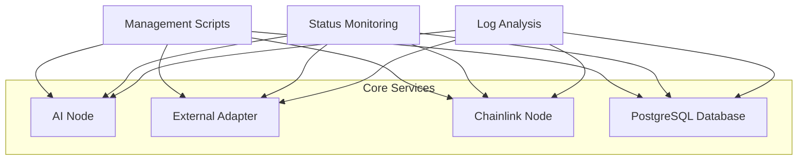
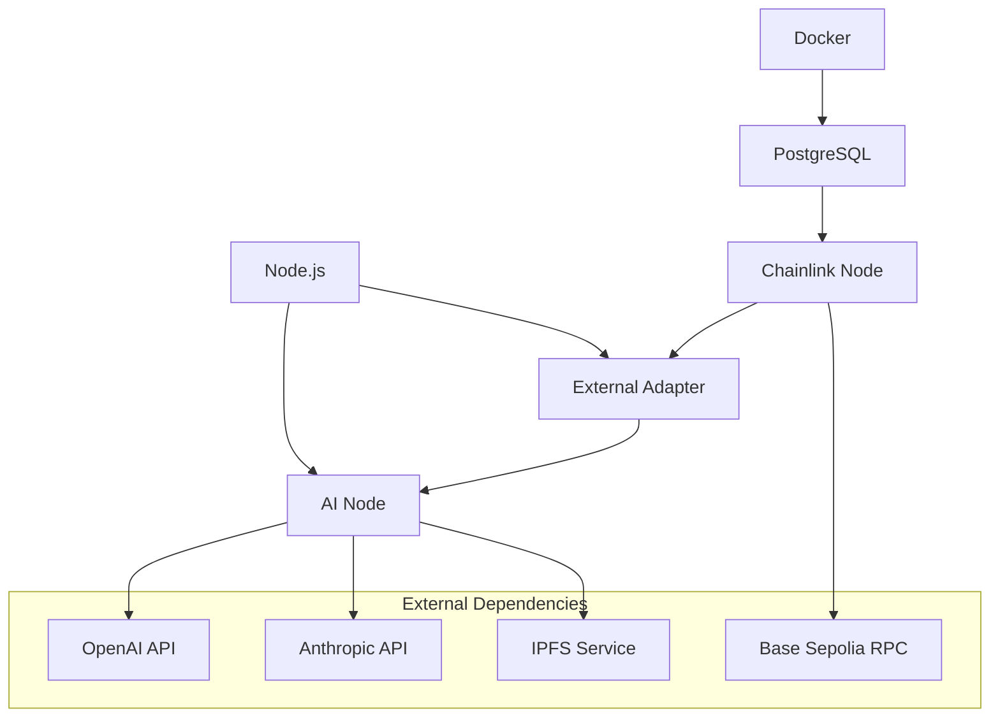

# Service Management

Once your Verdikta Arbiter Node is installed, you'll need to know how to manage and monitor your services effectively. This section covers all aspects of day-to-day node operation.

## Management Overview

Your Verdikta Arbiter Node consists of multiple services that work together:



## Quick Management Commands

Located in your installation directory (default: `~/verdikta-arbiter-node/`):

### Start All Services

```bash
cd ~/verdikta-arbiter-node
./start-arbiter.sh
```

### Stop All Services

```bash
cd ~/verdikta-arbiter-node
./stop-arbiter.sh
```

### Check Service Status

```bash
cd ~/verdikta-arbiter-node
./arbiter-status.sh
```

## Management Topics

<div class="grid cards" markdown>

-   :fontawesome-solid-play:{ .lg .middle } **Starting Services**

    ---

    Learn how to start your arbiter node services properly

    [:octicons-arrow-right-24: Starting Guide](starting.md)

-   :fontawesome-solid-stop:{ .lg .middle } **Stopping Services**

    ---

    Safely stop services and handle shutdown procedures

    [:octicons-arrow-right-24: Stopping Guide](stopping.md)

-   :fontawesome-solid-chart-line:{ .lg .middle } **Status Monitoring**

    ---

    Monitor service health and performance metrics

    [:octicons-arrow-right-24: Monitoring Guide](status.md)

-   :fontawesome-solid-file-text:{ .lg .middle } **Logs & Debugging**

    ---

    Access and analyze service logs for troubleshooting

    [:octicons-arrow-right-24: Logging Guide](logs.md)

</div>

## Service Architecture

### Service Dependencies

Understanding service dependencies helps with troubleshooting:



### Service Ports

Default port assignments:

| Service | Port | Protocol | Access |
|---------|------|----------|---------|
| **AI Node** | 3000 | HTTP | Local/External |
| **External Adapter** | 8080 | HTTP | Local only |
| **Chainlink Node** | 6688 | HTTP | Local/External |
| **PostgreSQL** | 5432 | TCP | Local only |

## Common Management Tasks

### Daily Operations

- **Health Checks**: Verify all services are running
- **Log Review**: Check for errors or warnings
- **Performance Monitoring**: Track response times and resource usage

### Weekly Maintenance

- **Backup Creation**: Backup configuration and database
- **Log Rotation**: Archive old logs to save space
- **Update Checks**: Review for available updates

### Monthly Tasks

- **Performance Analysis**: Review monthly performance metrics
- **Security Updates**: Apply security patches
- **Configuration Review**: Verify settings are optimal

## Service Health Indicators

### Healthy Status

```bash
=== Verdikta Arbiter Node Status ===

[AI Node] Running on port 3000 ✓
[External Adapter] Running on port 8080 ✓  
[Chainlink Node] Running on port 6688 ✓
[PostgreSQL] Running on port 5432 ✓

All services are running correctly!
```

### Warning Signs

- Services showing as "Stopped" or "Error"
- High memory or CPU usage
- Frequent restart cycles
- Network connectivity issues
- API authentication failures

### Critical Issues

- Multiple services down
- Database corruption
- Out of disk space
- Network isolation
- Contract deployment failures

## Resource Monitoring

### System Resources

Monitor these key metrics:

- **CPU Usage**: Should stay below 80% under normal load
- **Memory Usage**: Watch for memory leaks in Node.js services
- **Disk Space**: Ensure sufficient space for logs and database
- **Network**: Monitor bandwidth for IPFS and API calls

### Service-Specific Metrics

#### AI Node
- Request processing time
- AI model response rates
- IPFS retrieval performance
- Error rates by request type

#### Chainlink Node
- Job execution success rate
- Oracle response times
- Gas usage patterns
- LINK token balance

#### External Adapter
- Bridge request/response volume
- Data validation errors
- Timeout incidents
- Connection pool status

## Automated Monitoring

### Service Health Checks

You can automate status monitoring with cron jobs:

```bash
# Add to crontab (crontab -e)
# Check status every 5 minutes
*/5 * * * * cd ~/verdikta-arbiter-node && ./arbiter-status.sh >> ~/arbiter-health.log
```

### Log Rotation

Set up automatic log rotation:

```bash
# Add to /etc/logrotate.d/verdikta-arbiter
~/verdikta-arbiter-node/*/logs/*.log {
    daily
    missingok
    rotate 7
    compress
    notifempty
    create 644 root root
}
```

### Restart on Failure

Implement automatic restart for critical services:

```bash
# systemd service file example
[Unit]
Description=Verdikta Arbiter Node
After=docker.service

[Service]
Type=oneshot
ExecStart=/home/user/verdikta-arbiter-node/start-arbiter.sh
ExecStop=/home/user/verdikta-arbiter-node/stop-arbiter.sh
RemainAfterExit=yes
Restart=on-failure

[Install]
WantedBy=multi-user.target
```

## Emergency Procedures

### Service Recovery

If services become unresponsive:

1. **Stop All Services**
   ```bash
   ./stop-arbiter.sh
   ```

2. **Check System Resources**
   ```bash
   df -h  # Disk space
   free -m  # Memory usage
   top     # CPU usage
   ```

3. **Review Logs**
   ```bash
   # Check for recent errors
   tail -n 100 ~/verdikta-arbiter-node/*/logs/*.log
   ```

4. **Restart Services**
   ```bash
   ./start-arbiter.sh
   ```

### Database Recovery

If PostgreSQL issues occur:

```bash
# Check database status
docker ps | grep postgres

# View database logs
docker logs postgres-db

# Restart database only
docker restart postgres-db
```

### Network Issues

For connectivity problems:

```bash
# Test external API connectivity
curl -s https://api.openai.com/v1/models
curl -s https://api.anthropic.com/

# Test blockchain connectivity
curl -s -X POST -H "Content-Type: application/json" \
  --data '{"jsonrpc":"2.0","method":"eth_blockNumber","params":[],"id":1}' \
  YOUR_RPC_ENDPOINT
```

## Performance Optimization

### Resource Tuning

- **AI Node**: Adjust worker processes based on CPU cores
- **Chainlink Node**: Optimize database connection pools
- **PostgreSQL**: Tune memory settings for workload
- **Docker**: Set appropriate resource limits

### Scaling Considerations

- **Horizontal Scaling**: Multiple arbiter nodes for load distribution
- **Vertical Scaling**: Increase resources for single node performance
- **Load Balancing**: Distribute requests across multiple nodes

## Best Practices

### Security

- **Regular Updates**: Keep all components updated
- **Access Control**: Limit network access to necessary ports
- **Key Management**: Rotate API keys and credentials regularly
- **Monitoring**: Set up alerts for security events

### Reliability

- **Backup Strategy**: Regular backups of configuration and data
- **Redundancy**: Consider multiple nodes for critical deployments
- **Monitoring**: Comprehensive health and performance monitoring
- **Documentation**: Keep operational procedures documented

### Performance

- **Resource Monitoring**: Track usage patterns and optimize
- **Log Management**: Implement proper log rotation and archival
- **Network Optimization**: Use efficient API calls and caching
- **Database Maintenance**: Regular PostgreSQL maintenance

---

## Getting Started

Ready to learn service management? Start with:

1. **[Starting Services](starting.md)** - How to properly start your node
2. **[Status Monitoring](status.md)** - Monitor your node's health
3. **[Log Analysis](logs.md)** - Understanding and analyzing logs

!!! tip "Management Best Practices"

    Effective service management is key to running a reliable arbiter node. Regular monitoring and maintenance will help ensure optimal performance and minimize downtime. 