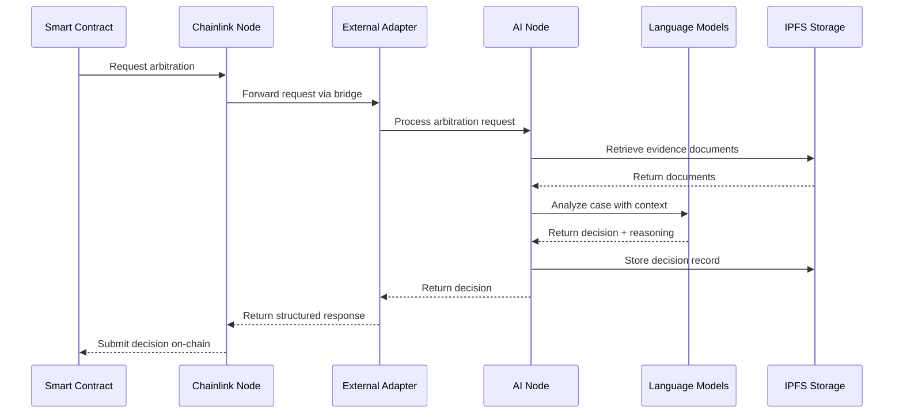

# Overview

The Verdikta Arbiter Node is a sophisticated oracle system that brings AI-powered dispute resolution to blockchain networks. This overview explains how the system works, its components, and the flow of arbitration requests.

## How Verdikta Arbiter Works

Verdikta Arbiter combines cutting-edge AI technology with proven Chainlink oracle infrastructure to provide automated, intelligent dispute resolution services for smart contracts and decentralized applications.



## Core Components

### Chainlink Node

The Chainlink Node serves as the oracle infrastructure backbone:

- **Oracle Network Integration**: Connects to blockchain networks (currently Base Sepolia)
- **Job Management**: Executes predefined job specifications for arbitration requests
- **Data Security**: Handles cryptographic signing and secure data transmission
- **Reputation Tracking**: Maintains oracle performance metrics and reliability scores

### External Adapter

The External Adapter acts as a bridge between the blockchain and AI systems:

- **Request Translation**: Converts blockchain requests into AI-processable formats
- **Data Validation**: Ensures request integrity and parameter validation
- **Response Formatting**: Structures AI decisions for blockchain consumption
- **Error Handling**: Manages failures and provides fallback mechanisms

### AI Node

The AI Node is the core intelligence system:

- **Multi-Model Support**: Integrates OpenAI GPT-4 and Anthropic Claude models
- **Evidence Processing**: Retrieves and analyzes documents from IPFS
- **Decision Generation**: Produces structured arbitration decisions with reasoning
- **Context Management**: Maintains conversation history and case context

### Smart Contracts

The on-chain components handle request lifecycle:

- **Operator Contract**: Manages oracle authorization and payment
- **Aggregator Contract**: Coordinates multiple oracles for consensus
- **Reputation System**: Tracks oracle performance and handles disputes

## Request Flow

### 1. Request Initiation

A smart contract initiates an arbitration request by calling the Chainlink Oracle:

```solidity
function requestArbitration(
    string memory caseDescription,
    string[] memory evidenceIPFSHashes,
    uint256 payment
) external {
    Chainlink.Request memory req = buildChainlinkRequest(
        jobId,
        address(this),
        this.fulfill.selector
    );
    req.add("caseDescription", caseDescription);
    req.addStringArray("evidence", evidenceIPFSHashes);
    sendChainlinkRequest(req, payment);
}
```

### 2. Oracle Processing

The Chainlink Node receives the request and triggers the job specification:

```toml
type = "directrequest"
schemaVersion = 1
name = "Verdikta Arbitration Job"
contractAddress = "OPERATOR_CONTRACT_ADDRESS"
maxTaskDuration = "5m"
observationSource = """
    decode_log   [type="ethabidecodelog"]
    decode_cbor  [type="cborparse"]
    fetch        [type="bridge" name="verdikta-adapter"]
    encode_data  [type="ethabiencode"]
    encode_tx    [type="ethabiencodetx"]
    submit_tx    [type="ethabsubmittx"]
"""
```

### 3. AI Processing

The AI Node processes the request through several stages:

#### Evidence Retrieval
```javascript
// Fetch evidence documents from IPFS
const evidenceDocuments = await Promise.all(
    evidenceHashes.map(hash => ipfs.cat(hash))
);
```

#### AI Analysis
```javascript
// Analyze case with multiple AI models
const decisions = await Promise.all([
    analyzeWithGPT4(caseDescription, evidence),
    analyzeWithClaude(caseDescription, evidence)
]);

// Consensus or confidence-based selection
const finalDecision = selectBestDecision(decisions);
```

#### Response Generation
```javascript
// Structure response for blockchain
const response = {
    decision: finalDecision.ruling,
    confidence: finalDecision.confidence,
    reasoning: finalDecision.explanation,
    evidenceReview: finalDecision.evidenceAnalysis
};
```

### 4. Response Delivery

The decision is returned to the requesting smart contract:

```solidity
function fulfill(
    bytes32 requestId,
    uint256 decision,
    uint256 confidence,
    string memory reasoning
) external recordChainlinkFulfillment(requestId) {
    // Process arbitration result
    emit ArbitrationComplete(requestId, decision, confidence);
}
```

## Architecture Benefits

### Decentralization

- **Multiple Oracles**: Supports multiple arbiter nodes for consensus
- **No Single Point of Failure**: Distributed architecture ensures reliability
- **Transparent Operations**: All decisions and reasoning are recorded on-chain

### AI-Powered Intelligence

- **Advanced Language Models**: Leverages state-of-the-art AI for nuanced decisions
- **Multi-Model Consensus**: Uses multiple AI providers for robust analysis
- **Continuous Learning**: System improves through experience and feedback

### Blockchain Integration

- **Native Compatibility**: Built specifically for blockchain dispute resolution
- **Cryptographic Security**: All communications are cryptographically secured
- **Payment Automation**: Automated oracle payments and fee distribution

### Transparency & Auditability

- **Decision Reasoning**: Every decision includes detailed explanation
- **Evidence Trail**: Complete audit trail of evidence and analysis
- **Performance Metrics**: Oracle performance is tracked and public

## Use Cases

### Smart Contract Disputes

- **DeFi Protocol Disputes**: Resolve complex financial disagreements
- **Insurance Claims**: Automated claim processing and validation
- **Escrow Services**: Fair resolution of escrow disputes

### DAO Governance

- **Proposal Evaluation**: AI-assisted governance proposal analysis
- **Conflict Resolution**: Resolve internal DAO disputes
- **Resource Allocation**: Fair distribution decisions

### NFT and Digital Assets

- **Authenticity Disputes**: Verify NFT originality and ownership
- **Royalty Conflicts**: Resolve creator compensation disputes
- **Platform Violations**: Content moderation and policy enforcement

## Security Considerations

### Data Privacy

- **Encrypted Communications**: All data transmission is encrypted
- **Selective Disclosure**: Only necessary data is shared with AI models
- **IPFS Integration**: Decentralized storage for evidence documents

### Oracle Security

- **Multi-Signature Validation**: Critical operations require multiple signatures
- **Rate Limiting**: Protection against spam and abuse
- **Slashing Conditions**: Penalties for malicious behavior

### AI Model Security

- **Input Sanitization**: All inputs are validated and sanitized
- **Output Validation**: AI responses are checked for consistency
- **Fallback Mechanisms**: Backup systems for AI model failures

## Performance Metrics

### Response Times

- **Evidence Retrieval**: < 30 seconds
- **AI Analysis**: 1-3 minutes depending on complexity
- **Total Processing**: < 5 minutes for standard cases

### Accuracy Targets

- **Decision Accuracy**: > 90% based on expert review
- **Consistency**: > 95% agreement between multiple AI models
- **Appeal Rate**: < 5% of decisions are appealed

### Scalability

- **Concurrent Requests**: Supports 10+ simultaneous arbitrations
- **Daily Capacity**: 100+ arbitration requests per day
- **Network Growth**: Scales horizontally with additional nodes

## Economic Model

### Oracle Payments

- **Request Fees**: Paid in LINK tokens for each arbitration
- **Performance Bonuses**: Higher accuracy earns increased rewards
- **Reputation Stakes**: Oracles stake tokens for participation rights

### Cost Structure

- **AI Model Costs**: Pay-per-use pricing for GPT-4 and Claude
- **IPFS Storage**: Minimal costs for document storage
- **Infrastructure**: Hosting and maintenance expenses

## Future Roadmap

### Network Expansion

- **Multi-Chain Support**: Ethereum, Polygon, Arbitrum integration
- **Cross-Chain Arbitration**: Disputes spanning multiple networks
- **Enterprise Integration**: Private network deployment options

### AI Enhancement

- **Specialized Models**: Domain-specific AI training
- **Human-in-the-Loop**: Expert review for complex cases
- **Continuous Learning**: Model improvement through case history

### Governance Evolution

- **Decentralized Governance**: Community-driven protocol upgrades
- **Oracle DAO**: Node operator governance participation
- **Reputation Staking**: Enhanced economic security mechanisms

---

## Next Steps

Ready to deploy your own arbiter node? Choose your path:

1. **Quick Setup**: Follow the [Quick Start Guide](quick-start.md) for automated installation
2. **Detailed Installation**: Use the [Installation Guide](installation/index.md) for step-by-step setup
3. **Prerequisites**: Review [system requirements](prerequisites.md) first

!!! tip "Understanding the System"
    
    This overview provides a high-level understanding of Verdikta Arbiter. For technical details about specific components, refer to the [Installation Guide](installation/index.md) and [Reference Documentation](reference/index.md). 