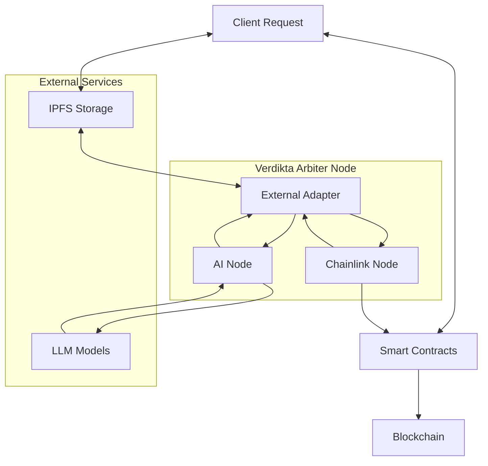

# Verdikta Arbiter Node Installation Guide

Welcome to the comprehensive installation guide for the Verdikta Arbiter Node. This documentation will help you set up a complete Chainlink-based arbitration node that processes dispute resolution requests using advanced AI models.

## What is Verdikta Arbiter?

Verdikta Arbiter is a decentralized oracle system that provides AI-powered dispute resolution services on blockchain networks. It combines:

- **AI-powered Decision Making**: Uses state-of-the-art language models (GPT-4, Claude) for intelligent adjudication
- **Chainlink Integration**: Built on Chainlink's proven oracle infrastructure for reliability and security
- **Reputation System**: Tracks oracle performance and builds trust through transparent scoring
- **Multi-chain Support**: Currently supports Base Sepolia with plans for additional networks

## Quick Navigation

<div class="grid cards" markdown>

-   :fontawesome-solid-rocket:{ .lg .middle } **Quick Start**

    ---

    Get your arbiter node running in minutes with our automated installer

    [:octicons-arrow-right-24: Quick Start Guide](quick-start.md)

-   :fontawesome-solid-list-check:{ .lg .middle } **Prerequisites**

    ---

    Check system requirements and prepare your environment

    [:octicons-arrow-right-24: View Prerequisites](prerequisites.md)

-   :fontawesome-solid-gear:{ .lg .middle } **Installation**

    ---

    Step-by-step installation guides for automated and manual setup

    [:octicons-arrow-right-24: Installation Guide](installation/index.md)

-   :fontawesome-solid-chart-line:{ .lg .middle } **Management**

    ---

    Learn how to manage, monitor, and maintain your arbiter node

    [:octicons-arrow-right-24: Management Guide](management/index.md)

</div>

## Architecture Overview

The Verdikta Arbiter Node consists of several integrated components:



### Core Components

- **Chainlink Node**: Oracle infrastructure that handles blockchain interactions
- **External Adapter**: Bridge between Chainlink and the AI processing system
- **AI Node**: Core service that processes adjudication requests using language models
- **PostgreSQL Database**: Stores Chainlink node data and job history
- **Smart Contracts**: On-chain components for request handling and reputation management

## Installation Options

Choose the installation method that best fits your needs:

### :simple-automattic: Automated Installation (Recommended)

Perfect for most users who want a quick, hassle-free setup:

```bash
cd verdikta-arbiter/installer
bash bin/install.sh
```

**Features:**
- Interactive setup with guided prompts
- Automatic dependency installation
- Environment configuration
- Smart contract deployment
- Oracle registration

### :material-wrench: Manual Installation

For advanced users who need fine-grained control:

- Step-by-step component installation
- Custom configuration options  
- Detailed troubleshooting capabilities
- Educational value for understanding the system

## System Requirements

!!! info "Minimum Requirements"

    - **OS**: Ubuntu 20.04+, macOS 11+, or Windows with WSL2
    - **RAM**: 6GB minimum (8GB+ recommended)
    - **Storage**: 100GB available space
    - **CPU**: 2+ cores recommended
    - **Network**: Stable internet connection

## API Keys Required

Before installation, ensure you have the following API keys:

- **OpenAI**: For GPT-4 access (recommended for best performance)
- **Anthropic**: For Claude access (alternative/backup AI provider)
- **Infura/Alchemy**: Web3 provider for Base Sepolia network
- **IPFS Service**: Pinata or Infura IPFS for document storage
- **Testnet Funds**: Base Sepolia ETH and LINK tokens

## Support & Community

Need help? We're here to assist:

- **Documentation**: Comprehensive guides and troubleshooting
- **GitHub Issues**: Report bugs and request features
- **Discord Community**: Chat with other node operators
- **Email Support**: Direct assistance for urgent issues

---

## Getting Started

Ready to begin? Start with our [Quick Start Guide](quick-start.md) for the fastest path to running your arbiter node, or check the [Prerequisites](prerequisites.md) to ensure your system is ready.

!!! tip "First Time Setup"

    New to blockchain oracles? We recommend starting with the [Overview](overview.md) to understand how Verdikta Arbiter works before diving into installation. 