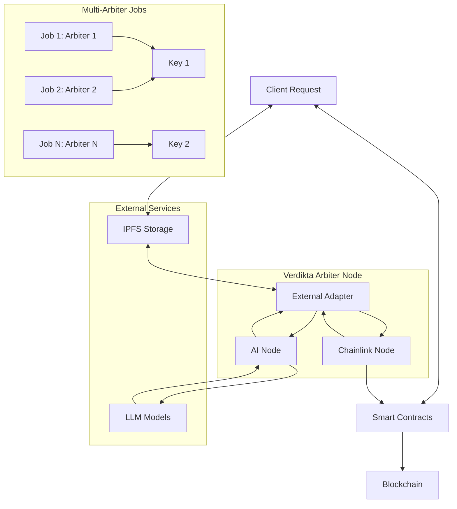

# Verdikta Arbiter Node Installation Guide

Welcome to the comprehensive installation guide for the Verdikta Arbiter Node. This documentation will help you set up a complete Chainlink-based arbitration node that processes dispute resolution requests using advanced AI models.

## What is Verdikta Arbiter?

Verdikta Arbiter is a decentralized oracle system that provides AI-powered dispute resolution services on blockchain networks. It combines:

- **AI-powered Decision Making**: Uses state-of-the-art language models (GPT-4, Claude) for intelligent adjudication
- **Chainlink Integration**: Built on Chainlink's proven oracle infrastructure for reliability and security
- **Multi-Arbiter Support**: Deploy 1-10 arbiters per node with intelligent key management
- **Network Flexibility**: Supports both Base Sepolia (testnet) and Base Mainnet deployments
- **Reputation System**: Tracks oracle performance and builds trust through transparent scoring

## Quick Navigation

<div class="grid cards" markdown>

-   :fontawesome-solid-gear:{ .lg .middle } **Installation Guide**

    ---

    Get your arbiter node running in minutes with our automated installer and complete setup guide

    [:octicons-arrow-right-24: Installation Guide](quick-start.md)

-   :material-help-circle:{ .lg .middle } **Prompts Guide**

    ---

    Understand installer prompts and learn how to obtain required API keys

    [:octicons-arrow-right-24: Prompts Guide](installation/prompts-guide.md)

-   :fontawesome-solid-chart-line:{ .lg .middle } **Management**

    ---

    Learn how to manage, monitor, and maintain your arbiter node

    [:octicons-arrow-right-24: Management Guide](management/index.md)

</div>

## Architecture Overview

The Verdikta Arbiter Node consists of several integrated components that can be scaled to support multiple arbiters:



### Core Components

- **Chainlink Node**: Oracle infrastructure supporting 1-10 arbiter jobs with individual key management
- **External Adapter**: Bridge between Chainlink and the AI processing system with multi-arbiter routing
- **AI Node**: Core service that processes adjudication requests using language models
- **PostgreSQL Database**: Stores Chainlink node data and job history for all arbiters
- **Smart Contracts**: On-chain components for request handling and reputation management

## Installation Options

Choose the installation method that best fits your needs:

### :simple-automattic: Automated Installation (Recommended)

Perfect for most users who want a quick, hassle-free setup with multi-arbiter support:

```bash
cd verdikta-arbiter/installer
./bin/install.sh -s
```

**Features:**
- Interactive network selection (Base Sepolia testnet vs Base Mainnet)
- Multi-arbiter configuration (1-10 arbiters with automated setup)
- Automatic dependency installation and key management
- Environment configuration with network-specific settings
- Smart contract deployment with arbiter authorization
- Oracle registration with dispatcher support

### :material-wrench: Manual Installation

For advanced users who need fine-grained control:

- Step-by-step component installation
- Custom configuration options for each arbiter
- Detailed troubleshooting capabilities
- Educational value for understanding the system

## System Requirements

!!! info "Minimum Requirements"

    - **OS**: Ubuntu 20.04+, macOS 11+, or Windows with WSL2
    - **RAM**: 8GB minimum (12GB+ recommended for multiple arbiters)
    - **Storage**: 200GB available space (additional space for multi-arbiter setups)
    - **CPU**: 4+ cores recommended (higher for multiple arbiters)
    - **Network**: Stable internet connection with sufficient bandwidth

## Network Support

### Base Sepolia (Testnet) - Recommended for Testing
- **Chain ID**: 84532
- **Funding**: Free testnet ETH and LINK tokens
- **Purpose**: Development, testing, and learning
- **Configuration**: `~/.chainlink-testnet/`

### Base Mainnet - Production Ready
- **Chain ID**: 8453  
- **Funding**: Real ETH and LINK tokens required
- **Purpose**: Production deployments
- **Configuration**: `~/.chainlink-mainnet/`
- **Cost Estimation**: ~$50-100 USD for initial setup and deployment

## API Keys Required

Before installation, ensure you have the following API keys:

- **OpenAI**: For GPT-4 access (recommended for best performance)
- **Anthropic**: For Claude access (alternative/backup AI provider)
- **Infura/Alchemy**: Web3 provider for Base network access
- **IPFS Service**: Pinata or Infura IPFS for document storage
- **Network Funds**: ETH and LINK tokens for chosen network (testnet or mainnet)

## Multi-Arbiter Features

### Scalable Architecture
- **1-10 Arbiters**: Configure multiple arbiters on a single node
- **Intelligent Key Management**: Automatic key generation with 2 arbiters per key
- **Load Distribution**: Distribute arbitration load across multiple arbiters
- **Independent Jobs**: Each arbiter operates as a separate Chainlink job

### Key Management
- **Automatic Generation**: Keys created automatically based on arbiter count
- **Assignment Pattern**: Jobs 1-2 → Key 1, Jobs 3-4 → Key 2, etc.
- **Secure Storage**: Keys stored in network-specific directories
- **Authorization**: All keys automatically authorized with operator contracts

## Support & Community

Need help? We're here to assist:

- **Documentation**: Comprehensive guides and troubleshooting
- **GitHub Issues**: Report bugs and request features
- **Discord Community**: Chat with other node operators
- **Email Support**: Direct assistance for urgent issues

---

## Getting Started

Ready to begin? Start with our [Quick Start Guide](quick-start.md) for the fastest path to running your arbiter node, or check the [Prerequisites](prerequisites.md) to ensure your system is ready.

!!! tip "First Time Setup"

    New to blockchain oracles? We recommend:
    1. Start with the [Overview](overview.md) to understand how Verdikta Arbiter works
    2. Begin with **Base Sepolia testnet** for risk-free learning
    3. Start with **1 arbiter** to understand the system before scaling up
    4. Review the [Multi-Arbiter Design](MULTI_ARBITER_DESIGN.md) for advanced configurations

!!! warning "Production Deployment"

    Planning to deploy on **Base Mainnet**? 
    
    - Ensure you have sufficient ETH and LINK tokens (~$50-100 for setup)
    - Test thoroughly on testnet first
    - Consider starting with 1-2 arbiters before scaling
    - Review security best practices in our [Management Guide](management/index.md) 