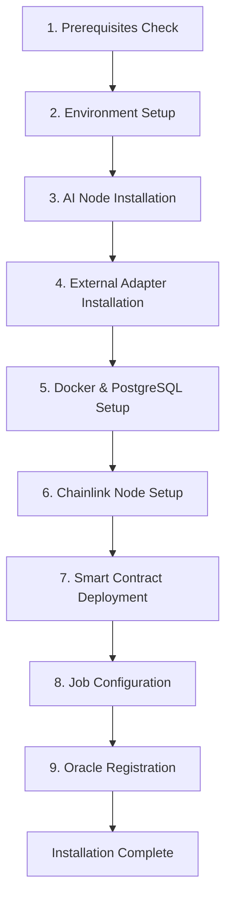

# Installation Guide

Welcome to the Verdikta Arbiter Node installation guide. The installer provides a fully automated setup process that handles all components and configuration.

## Quick Start

The automated installer is the recommended and only supported installation method:

<div class="grid cards" markdown>

-   :fontawesome-solid-question-circle:{ .lg .middle } **Prompts Guide**

    ---

    Understand installer prompts and learn how to obtain required API keys and information.

    [:octicons-arrow-right-24: Prompts Guide](prompts-guide.md)

-   :fontawesome-solid-magic:{ .lg .middle } **Automated Installation**

    ---

    Complete automated installation with guided setup prompts. Handles all 9 installation steps.

    [:octicons-arrow-right-24: Installation Guide](automated.md)

</div>

## Installation Overview

The installer performs 9 automated steps to set up your complete Verdikta Arbiter Node:



## What Gets Installed

The automated installer sets up these components:

| Component | Purpose | Port |
|-----------|---------|------|
| **AI Node** | Core AI processing service | 3000 |
| **External Adapter** | Blockchain-AI bridge | 8080 |
| **Chainlink Node** | Oracle infrastructure | 6688 |
| **PostgreSQL** | Database for Chainlink | 5432 |

## Prerequisites

Before installation, ensure your system meets these requirements:

- **System**: Ubuntu 20.04+, macOS 11+, or WSL2
- **Hardware**: 6GB+ RAM, 100GB+ storage, 2+ CPU cores
- **Network**: Stable internet connection
- **API Keys**: OpenAI, Anthropic, Web3 provider, IPFS service
- **Testnet Funds**: Base Sepolia ETH and LINK tokens

📋 Complete checklist: [Prerequisites Guide](../prerequisites.md)

## Installation Steps

1. **Clone Repository**
   ```bash
   git clone https://github.com/verdikta/verdikta-arbiter.git
   cd verdikta-arbiter/installer
   ```

2. **Run Automated Installer**
   ```bash
   bash bin/install.sh
   ```

3. **Follow Interactive Prompts**
   - The installer will check prerequisites automatically
   - Enter API keys and configuration when prompted
   - Wait for all 9 installation steps to complete

🚀 Detailed walkthrough: [Installation Guide](automated.md)

## Post-Installation

After successful installation:

### Access Your Services

- **AI Node**: `http://localhost:3000`
- **External Adapter**: `http://localhost:8080` 
- **Chainlink Node**: `http://localhost:6688`

### Management Scripts

Located in your installation directory (default: `~/verdikta-arbiter-node/`):

```bash
./start-arbiter.sh    # Start all services
./stop-arbiter.sh     # Stop all services
./arbiter-status.sh   # Check service status
```

### Verify Installation

Check that all services are running:

```bash
cd ~/verdikta-arbiter-node
./arbiter-status.sh
```

Access the Chainlink UI at [http://localhost:6688](http://localhost:6688) using credentials from `chainlink-node/info.txt`.

## Support

- **Documentation**: [Troubleshooting Guide](../troubleshooting/index.md)
- **GitHub Issues**: Report problems
- **Community**: Get help in Discord

---

Ready to install? **[Start Installation →](automated.md)** 