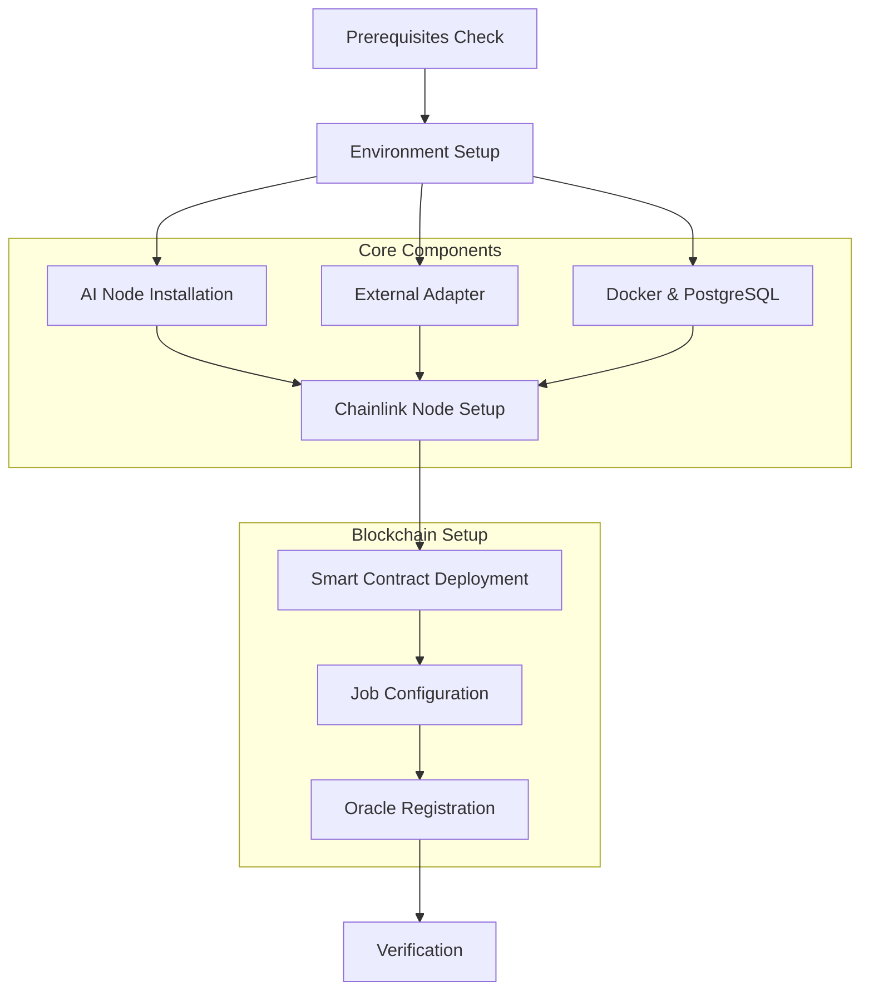

# Installation Guide

Welcome to the comprehensive installation guide for the Verdikta Arbiter Node. This section provides detailed instructions for setting up your oracle node, whether you prefer automated installation or want to understand each step in detail.

## Installation Methods

Choose the installation approach that best fits your needs and experience level:

<div class="grid cards" markdown>

-   :fontawesome-solid-question-circle:{ .lg .middle } **Prompts Guide**

    ---

    Understand every installer prompt and learn how to obtain required information.

    **Best for**: First-time users, API key setup, troubleshooting prompts

    [:octicons-arrow-right-24: Prompts Guide](prompts-guide.md)

-   :fontawesome-solid-magic:{ .lg .middle } **Automated Installation**

    ---

    Complete hands-off installation with guided setup prompts.

    **Best for**: Most users, production deployments, quick setup

    [:octicons-arrow-right-24: Automated Guide](automated.md)

-   :fontawesome-solid-wrench:{ .lg .middle } **Manual Installation**

    ---

    Step-by-step manual installation with full control over each component.

    **Best for**: Advanced users, custom configurations, learning

    [:octicons-arrow-right-24: Manual Guide](manual.md)

-   :fontawesome-solid-cog:{ .lg .middle } **Environment Setup**

    ---

    Configure API keys, settings, and environment variables.

    **Best for**: Re-configuration, troubleshooting, updates

    [:octicons-arrow-right-24: Environment Setup](environment.md)

</div>

## Installation Overview

The Verdikta Arbiter Node installation process involves several key components working together:



## Component Installation

Each component can be installed individually for advanced setups or troubleshooting:

### Core Services

| Component | Purpose | Installation Guide |
|-----------|---------|-------------------|
| **AI Node** | Core AI processing service | [AI Node Setup](components/ai-node.md) |
| **External Adapter** | Blockchain-AI bridge | [Adapter Setup](components/external-adapter.md) |
| **Docker & PostgreSQL** | Database infrastructure | [Docker Setup](components/docker-postgres.md) |
| **Chainlink Node** | Oracle infrastructure | [Chainlink Setup](components/chainlink.md) |

### Blockchain Components

| Component | Purpose | Installation Guide |
|-----------|---------|-------------------|
| **Smart Contracts** | On-chain oracle contracts | [Contract Deployment](components/smart-contracts.md) |
| **Job Configuration** | Oracle job and bridge setup | [Configuration](components/configuration.md) |

## Prerequisites Verification

Before beginning installation, ensure your system meets all requirements:

!!! info "System Check"

    Run the prerequisites checker to verify your system is ready:

    ```bash
    cd verdikta-arbiter/installer
    bash util/check-prerequisites.sh
    ```

### Required Resources

- **System**: Ubuntu 20.04+, macOS 11+, or WSL2
- **Hardware**: 6GB+ RAM, 100GB+ storage, 2+ CPU cores
- **Network**: Stable internet connection
- **API Keys**: OpenAI, Anthropic, Web3 provider, IPFS service
- **Testnet Funds**: Base Sepolia ETH and LINK tokens

📋 Complete checklist: [Prerequisites Guide](../prerequisites.md)

## Installation Paths

### Path 1: Quick Start (Recommended)

Perfect for most users who want to get running quickly:

1. **Clone Repository**
   ```bash
   git clone https://github.com/verdikta/verdikta-arbiter.git
   cd verdikta-arbiter/installer
   ```

2. **Run Automated Installer**
   ```bash
   bash bin/install.sh
   ```

3. **Follow Interactive Prompts**
   - Enter API keys and configuration
   - Wait for automated installation
   - Verify services are running

🚀 Detailed walkthrough: [Quick Start Guide](../quick-start.md)

### Path 2: Manual Installation

For users who need custom configurations or want to understand each step:

1. **Check Prerequisites**
   ```bash
   bash util/check-prerequisites.sh
   ```

2. **Setup Environment**
   ```bash
   bash bin/setup-environment.sh
   ```

3. **Install Components Individually**
   ```bash
   bash bin/install-ai-node.sh
   bash bin/install-adapter.sh
   bash bin/setup-docker.sh
   bash bin/setup-chainlink.sh
   ```

4. **Deploy and Configure**
   ```bash
   bash bin/deploy-contracts.sh
   bash bin/configure-node.sh
   ```

🔧 Complete manual guide: [Manual Installation](manual.md)

## Post-Installation

After successful installation, you'll have:

### Running Services

- **AI Node**: `http://localhost:3000`
- **External Adapter**: `http://localhost:8080`
- **Chainlink Node**: `http://localhost:6688`
- **PostgreSQL**: `localhost:5432`

### Management Scripts

Located in your installation directory (default: `~/verdikta-arbiter-node/`):

```bash
./start-arbiter.sh    # Start all services
./stop-arbiter.sh     # Stop all services
./arbiter-status.sh   # Check service status
```

### Important Files

- **Contract Information**: `~/verdikta-arbiter-node/installer/.contracts`
- **Chainlink Credentials**: `~/verdikta-arbiter-node/chainlink-node/info.txt`
- **Environment Config**: Various `.env` files in component directories

## Verification Steps

After installation, verify everything is working:

### 1. Service Status Check

```bash
cd ~/verdikta-arbiter-node
./arbiter-status.sh
```

### 2. Chainlink UI Access

1. Open [http://localhost:6688](http://localhost:6688)
2. Login with credentials from `chainlink-node/info.txt`
3. Verify job is active in Jobs section

### 3. AI Node Health Check

```bash
curl http://localhost:3000/health
```

### 4. End-to-End Test

The installer includes verification scripts:

```bash
cd verdikta-arbiter/installer
bash util/verify-installation.sh
```

## Troubleshooting Installation

### Common Issues

| Issue | Solution |
|-------|----------|
| **Port conflicts** | Check running services with `lsof -i :PORT` |
| **Docker not running** | Start Docker: `sudo systemctl start docker` |
| **API key errors** | Re-run: `bash bin/setup-environment.sh` |
| **Contract deployment fails** | Check testnet funds and network connectivity |
| **Services won't start** | Check logs and restart Docker |

🔍 Detailed troubleshooting: [Troubleshooting Guide](../troubleshooting/index.md)

## Next Steps

Once installation is complete:

1. **Oracle Registration**: [Register with dispatcher](../oracle/dispatcher.md)
2. **Service Management**: [Learn management commands](../management/index.md)
3. **Monitoring Setup**: [Configure status monitoring](../management/status.md)
4. **Backup Creation**: [Setup backup procedures](../maintenance/backup.md)

## Support

Need help with installation?

- **Documentation**: Browse component-specific guides
- **GitHub Issues**: Report installation problems
- **Discord**: Get community help in real-time
- **Email**: Contact support for urgent issues

!!! tip "Installation Success"

    A successful installation should have all services running and accessible. The Chainlink UI should show an active job, and the AI Node should respond to health checks.

---

Ready to begin? Choose your installation method:

- 🚀 **Quick Start**: [Automated Installation](automated.md)
- 🔧 **Advanced Setup**: [Manual Installation](manual.md)
- ⚙️ **Configuration Only**: [Environment Setup](environment.md) 