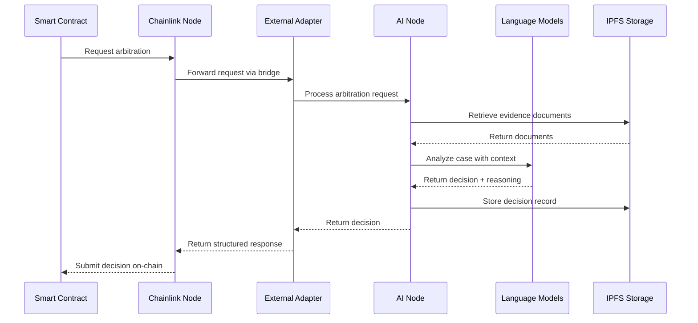

# Overview

The Verdikta Arbiter Node is a sophisticated oracle system that brings AI-powered dispute resolution to blockchain networks. This overview explains how the system works, its components, and the flow of arbitration requests.

## How Verdikta Arbiter Works

Verdikta Arbiter combines cutting-edge AI technology with proven Chainlink oracle infrastructure to provide automated, intelligent dispute resolution services for smart contracts and decentralized applications.



## Core Components

### Chainlink Node

The Chainlink Node serves as the oracle infrastructure backbone:

- **Oracle Network Integration**: Connects to blockchain networks (currently Base Sepolia)
- **Job Management**: Executes predefined job specifications for arbitration requests
- **Data Security**: Handles cryptographic signing and secure data transmission
- **Reputation Tracking**: Maintains oracle performance metrics and reliability scores

### External Adapter

The External Adapter acts as a bridge between the blockchain and AI systems:

- **Request Translation**: Converts blockchain requests into AI-processable formats
- **Data Validation**: Ensures request integrity and parameter validation
- **Response Formatting**: Structures AI decisions for blockchain consumption
- **Error Handling**: Manages failures and provides fallback mechanisms

### AI Node

The AI Node is the core intelligence system:

- **Multi-Model Support**: Integrates OpenAI GPT-4 and Anthropic Claude models
- **Evidence Processing**: Retrieves and analyzes documents from IPFS
- **Decision Generation**: Produces structured arbitration decisions with reasoning
- **Context Management**: Maintains conversation history and case context

### Smart Contracts

The on-chain components handle request lifecycle:

- **Operator Contract**: Manages oracle authorization and payment
- **Aggregator Contract**: Coordinates multiple oracles for consensus
- **Reputation System**: Tracks oracle performance and handles disputes

## Request Flow

### 1. Request Initiation

A client contract submits a request to the ETH-funded **ReputationAggregator**
(deployed from the separate `verdikta-dispatcher` repo). Evidence is referenced
by IPFS CID(s); arbiters are paid in native ETH attached as `msg.value`:

```solidity
bytes32 aggRequestId = aggregator.requestAIEvaluationWithApproval{
    value: aggregator.maxTotalFee(maxOracleFee)
}(
    cids,                      // IPFS CIDs of the evidence archive(s)
    "",                        // addendum text ("" if none)
    500,                       // alpha (oracle-selection blend)
    maxOracleFee,              // per-oracle fee ceiling (wei)
    estimatedBaseCost,
    maxFeeBasedScalingFactor,
    128                        // requestedClass (ClassID / model pool)
);
```

### 2. Oracle Processing

The aggregator selects arbiters via the ReputationKeeper and emits an
`OracleRequest` to each selected **ArbiterOperator**. That operator's Chainlink
node runs a `directrequest` job that calls the **`verdikta-ai`** bridge (the
External Adapter). See `chainlink-node/basicJobSpec` for the full template:

```toml
type = "directrequest"
schemaVersion = 1
observationSource = """
    decode_log   [type="ethabidecodelog" ...]          # OracleRequest
    decode_cbor  [type="cborparse" data="$(decode_log.data)"]
    fetch        [type="bridge" name="verdikta-ai"
                  requestData="{\\"id\\": $(jobSpec.externalJobID), \\"data\\": {\\"cid\\": $(decode_cbor.cid), \\"aggId\\": $(decode_cbor.aggId)}}"]
    parse_scores [type="jsonparse" path="data,aggregatedScore" data="$(fetch)"]
    parse_cid    [type="jsonparse" path="data,justificationCid" data="$(fetch)"]
    encode_data  [type="ethabiencode" abi="(bytes32 requestId, uint256[] value, string cid)" ...]
    encode_tx    [type="ethabiencode" abi="fulfillOracleRequestV(...)" ...]
    submit_tx    [type="ethtx" to="{CONTRACT_ADDRESS}" ...]
"""
```

### 3. AI Processing

The External Adapter fetches the evidence archive from IPFS and calls the AI
Node's `POST /api/rank-and-justify`. The AI Node runs the model panel in
parallel and returns a **score array that sums to 1,000,000** plus a
justification; the External Adapter uploads the justification JSON to IPFS:

```javascript
// External Adapter → AI Node (external-adapter/src/services/aiClient.js)
const { data } = await aiClient.post('/api/rank-and-justify', {
    prompt, outcomes, models, iterations, attachments
});
// data.scores → [{ outcome, score }], sums to 1,000,000
const justificationCid = await ipfsClient.uploadToIPFS(justificationFile);
```

For commit-reveal rounds the adapter uses `cid` mode prefixes (`1:` commit,
`2:` reveal) so aggregated oracles can't copy one another.

### 4. Response Delivery

The Chainlink job encodes `(bytes32 requestId, uint256[] scores, string cid)`
and submits it to the ArbiterOperator, which forwards it to the aggregator:

```solidity
// arbiter-operator/contracts/ArbiterOperator.sol
function fulfillOracleRequestV(
    bytes32 requestId,
    uint256 payment,
    address callbackAddress,
    bytes4  callbackFunctionId,
    uint256 expiration,
    bytes   calldata data          // ABI-encoded (uint256[] scores, string cid)
) external returns (bool success);
```

The aggregator records each arbiter's response, aggregates them via
commit-reveal, and exposes the final result through
`getEvaluation(aggRequestId) → (uint256[] scores, string justificationCID, bool exists)`.

## Architecture Benefits

### Decentralization

- **Multiple Oracles**: Supports multiple arbiter nodes for consensus
- **No Single Point of Failure**: Distributed architecture ensures reliability
- **Transparent Operations**: All decisions and reasoning are recorded on-chain

### AI-Powered Intelligence

- **Advanced Language Models**: Leverages state-of-the-art AI for nuanced decisions
- **Multi-Model Consensus**: Uses multiple AI providers for robust analysis
- **Continuous Learning**: System improves through experience and feedback

### Blockchain Integration

- **Native Compatibility**: Built specifically for blockchain dispute resolution
- **Cryptographic Security**: All communications are cryptographically secured
- **Payment Automation**: Automated oracle payments and fee distribution

### Transparency & Auditability

- **Decision Reasoning**: Every decision includes detailed explanation
- **Evidence Trail**: Complete audit trail of evidence and analysis
- **Performance Metrics**: Oracle performance is tracked and public

## Use Cases

### Smart Contract Disputes

- **DeFi Protocol Disputes**: Resolve complex financial disagreements
- **Insurance Claims**: Automated claim processing and validation
- **Escrow Services**: Fair resolution of escrow disputes

### DAO Governance

- **Proposal Evaluation**: AI-assisted governance proposal analysis
- **Conflict Resolution**: Resolve internal DAO disputes
- **Resource Allocation**: Fair distribution decisions

### NFT and Digital Assets

- **Authenticity Disputes**: Verify NFT originality and ownership
- **Royalty Conflicts**: Resolve creator compensation disputes
- **Platform Violations**: Content moderation and policy enforcement

## Security Considerations

### Data Privacy

- **Encrypted Communications**: All data transmission is encrypted
- **Selective Disclosure**: Only necessary data is shared with AI models
- **IPFS Integration**: Decentralized storage for evidence documents

### Oracle Security

- **Multi-Signature Validation**: Critical operations require multiple signatures
- **Rate Limiting**: Protection against spam and abuse
- **Slashing Conditions**: Penalties for malicious behavior

### AI Model Security

- **Input Sanitization**: All inputs are validated and sanitized
- **Output Validation**: AI responses are checked for consistency
- **Fallback Mechanisms**: Backup systems for AI model failures

## Performance Metrics

### Response Times

- **Evidence Retrieval**: < 30 seconds
- **AI Analysis**: 1-3 minutes depending on complexity
- **Total Processing**: < 5 minutes for standard cases

### Accuracy Targets

- **Decision Accuracy**: > 90% based on expert review
- **Consistency**: > 95% agreement between multiple AI models
- **Appeal Rate**: < 5% of decisions are appealed

### Scalability

- **Concurrent Requests**: Supports 10+ simultaneous arbitrations
- **Daily Capacity**: 100+ arbitration requests per day
- **Network Growth**: Scales horizontally with additional nodes

## Economic Model

### Oracle Payments

- **Request Fees**: Paid in LINK tokens for each arbitration
- **Performance Bonuses**: Higher accuracy earns increased rewards
- **Reputation Stakes**: Oracles stake tokens for participation rights

### Cost Structure

- **AI Model Costs**: Pay-per-use pricing for GPT-4 and Claude
- **IPFS Storage**: Minimal costs for document storage
- **Infrastructure**: Hosting and maintenance expenses

## Performance Optimizations

The Verdikta Arbiter installer includes comprehensive performance optimizations to ensure reliable job processing and minimal latency:

### Database Optimizations

- **Memory Configuration**: Optimized PostgreSQL settings for improved query performance
  - `work_mem`: 16MB (4x default) for faster query processing
  - `shared_buffers`: 128MB for enhanced caching
  - `effective_cache_size`: 1GB for better query planning
- **Write Performance**: Dedicated WAL buffers (16MB) for faster transaction logging
- **Connection Management**: Stable connection pooling with 100 max connections

### Chainlink Node Optimizations

- **Transaction Processing**: Faster cleanup intervals (15min vs 30min default)
- **Block Detection**: Improved head tracking (20s vs 30s) for faster job initiation
- **Enhanced Logging**: Info-level logging for better troubleshooting visibility
- **Network Efficiency**: Optimized sampling intervals for reduced latency

### Job Processing Performance

- **Completion Times**: Jobs typically complete within 2-3 minutes
- **Error Handling**: Robust error recovery with minimal false positives
- **Resource Management**: Optimized memory usage across all components

These optimizations are automatically applied during installation, ensuring your arbiter node operates at peak performance from day one.

## Future Roadmap

### Network Expansion

- **Multi-Chain Support**: Ethereum, Polygon, Arbitrum integration
- **Cross-Chain Arbitration**: Disputes spanning multiple networks
- **Enterprise Integration**: Private network deployment options

### AI Enhancement

- **Specialized Models**: Domain-specific AI training
- **Human-in-the-Loop**: Expert review for complex cases
- **Continuous Learning**: Model improvement through case history

### Governance Evolution

- **Decentralized Governance**: Community-driven protocol upgrades
- **Oracle DAO**: Node operator governance participation
- **Reputation Staking**: Enhanced economic security mechanisms

---

## Next Steps

Ready to deploy your own arbiter node? Choose your path:

1. **Quick Setup**: Follow the [Quick Start Guide](quick-start.md) for automated installation
2. **Detailed Installation**: Use the [Installation Guide](installation/index.md) for step-by-step setup
3. **Prerequisites**: Review [system requirements](prerequisites.md) first

!!! tip "Understanding the System"
    
    This overview provides a high-level understanding of Verdikta Arbiter. For technical details about specific components, refer to the [Installation Guide](installation/index.md) and [Reference Documentation](reference/index.md). 